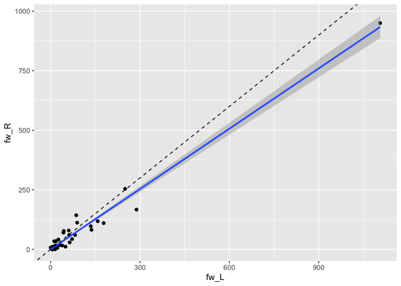

<!-- README.md is generated from README.Rmd. Please edit that file -->
<!-- devtools::build_readme() is a good way to build this -->


# coconatfly

<!-- badges: start -->

[](https://lifecycle.r-lib.org/articles/stages.html#experimental)
[](https://github.com/flyconnectome/coconatfly/actions/workflows/R-CMD-check.yaml)
<!-- badges: end -->

**coconatfly** enables comparative/integrative connectomics across
Drosophila datasets. The philosophy is to provide access to the most
important functions for connectome analysis in a way that is both
convenient and uniform across Drosophila datasets. The package builds
upon the [coconat](https://natverse.org/coconat/) package which provides
more basic and/or dataset agnostic functionality. In case you were
wondering, **coconat** stands for COmparative COnnectomics for the
NATverse and **coconatfly** enables this specifically for fly datasets.

Although the code is certainly already useful, it is currently highly
experimental, so the interface should not yet been relied upon. In
particular, it is quite likely that refactoring will abstract more
functionality into [coconat](https://natverse.org/coconat/) as time goes
by in order to enable the core functionality to be reused.

## Datasets

At present the following datasets are supported (dataset names used in
the package in brackets):

1.  Janelia hemibrain (**hemibrain**)
2.  Female Adult Fly Brain - FlyWire connectome (**flywire**)
3.  Wei Lee and colleagues Female Adult Nerve Cord (**fanc**)
4.  Janelia male Ventral Nerve Cord (**manc**)
5.  Janelia Male CNS (**malecns**)

The first three datasets are either public or access can be requested
subject to agreeing to certain terms of use. The Male VNC dataset is
scheduled for imminent release in June 2023. The Male CNS dataset is
currently in the early stages of proofreading and annotation in a
collaboration between the
[FlyEM](https://www.janelia.org/project-team/flyem) and [Cambridge
Drosophila Connectomics Group](https://flyconnecto.me). Release is
anticipated at the end of 2023.

## Installation

You can install the development version of coconatfly like so:

``` r
install.packages('natmanager')
natmanager::install(pkgs = 'flyconnectome/coconatfly')
```

Some of the datasets exposed by *coconatfly* require authentication for
access or are still being annotated in private pre-release. Please
consult individual package dependencies for authentication details and
do not be surprised if you do not have access to all datasets if you are
not a collaborator of the [fly connectome
group](https://flyconnecto.me).

For installation of private packages (currently restricted to in
preparation datasets being developed with our collaborators at the
[FlyEM Team at Janelia](https://www.janelia.org/project-team/flyem)) you
will need a GITHUB_PAT (Personal Access Token - an alternative to a
username+password).

This code checks if you have a PAT GITHUB_PAT and offers to make one if
necessary.

``` r
natmanager::check_pat()
```

## An example

First let’s load the libraries we need

``` r
library(coconatfly)
library(dplyr)
```

Two important functions are `cf_ids()` which allows you to specify a set
of neurons from one or more datasets and `cf_meta()` which fetches
information about the cell type. For example let’s fetch information
about DA1 projection neurons:

``` r
cf_meta(cf_ids('DA1_lPN', datasets = 'hemibrain'))
#>           id pre post upstream downstream status    statusLabel     voxels
#> 1 1734350788 621 2084     2084       4903 Traced Roughly traced 1174705998
#> 2 1734350908 725 2317     2317       5846 Traced Roughly traced 1382228240
#> 3 1765040289 702 2398     2398       5521 Traced Roughly traced 1380855164
#> 4 5813039315 691 2263     2263       5577 Traced Roughly traced 1016515847
#> 5  722817260 701 2435     2435       5635 Traced Roughly traced 1104413432
#> 6  754534424 646 2364     2364       5309 Traced Roughly traced 1265805547
#> 7  754538881 623 2320     2320       4867 Traced Roughly traced 1217284590
#>   cropped  instance    type cellBodyFiber notes  soma side class group
#> 1   FALSE DA1_lPN_R DA1_lPN         AVM02  <NA>  TRUE    R  <NA>  <NA>
#> 2   FALSE DA1_lPN_R DA1_lPN         AVM02  <NA>  TRUE    R  <NA>  <NA>
#> 3   FALSE DA1_lPN_R DA1_lPN         AVM02  <NA>  TRUE    R  <NA>  <NA>
#> 4   FALSE DA1_lPN_R DA1_lPN         AVM02  <NA> FALSE    R  <NA>  <NA>
#> 5   FALSE DA1_lPN_R DA1_lPN         AVM02  <NA> FALSE    R  <NA>  <NA>
#> 6   FALSE DA1_lPN_R DA1_lPN         AVM02  <NA>  TRUE    R  <NA>  <NA>
#> 7   FALSE DA1_lPN_R DA1_lPN         AVM02  <NA>  TRUE    R  <NA>  <NA>
#>     dataset
#> 1 hemibrain
#> 2 hemibrain
#> 3 hemibrain
#> 4 hemibrain
#> 5 hemibrain
#> 6 hemibrain
#> 7 hemibrain
```

We can also do that for multiple brain datasets

``` r
da1meta <- cf_meta(cf_ids('DA1_lPN', datasets = c('hemibrain', 'flywire')))
#> Updating 1767 ids
#> flywire_rootid_cached: Looking up 1767 missing keys
#> Updating 7520 ids
#> flywire_rootid_cached: Looking up 7520 missing keys
head(da1meta)
#>           id  instance    type side class group   dataset
#> 1 1734350788 DA1_lPN_R DA1_lPN    R  <NA>  <NA> hemibrain
#> 2 1734350908 DA1_lPN_R DA1_lPN    R  <NA>  <NA> hemibrain
#> 3 1765040289 DA1_lPN_R DA1_lPN    R  <NA>  <NA> hemibrain
#> 4 5813039315 DA1_lPN_R DA1_lPN    R  <NA>  <NA> hemibrain
#> 5  722817260 DA1_lPN_R DA1_lPN    R  <NA>  <NA> hemibrain
#> 6  754534424 DA1_lPN_R DA1_lPN    R  <NA>  <NA> hemibrain
```

``` r
da1meta %>% 
  count(dataset, side)
#>     dataset side n
#> 1   flywire    L 8
#> 2   flywire    R 7
#> 3 hemibrain    R 7
```

We can also fetch connectivity for these neurons:

``` r
da1ds <- da1meta %>% 
  cf_partners(threshold = 5, partners = 'output')
head(da1ds)
#> # A tibble: 6 × 8
#>    pre_id post_id weight side  type    dataset pre_key               post_key   
#>   <int64> <int64>  <int> <chr> <chr>   <chr>   <chr>                 <chr>      
#> 1    7e17    7e17     64 L     DA1_vPN flywire fw:720575940605102694 fw:7205759…
#> 2    7e17    7e17     50 L     <NA>    flywire fw:720575940603231916 fw:7205759…
#> 3    7e17    7e17     49 R     <NA>    flywire fw:720575940604407468 fw:7205759…
#> 4    7e17    7e17     48 R     DA1_vPN flywire fw:720575940623303108 fw:7205759…
#> 5    7e17    7e17     46 L     v2LN30  flywire fw:720575940603231916 fw:7205759…
#> 6    7e17    7e17     42 L     DA1_vPN flywire fw:720575940603231916 fw:7205759…
```

``` r
da1ds %>% 
  group_by(type, dataset, side) %>% 
  summarise(weight=sum(weight), npre=n_distinct(pre_id), npost=n_distinct(post_id))
#> `summarise()` has grouped output by 'type', 'dataset'. You can override using
#> the `.groups` argument.
#> # A tibble: 239 × 6
#> # Groups:   type, dataset [195]
#>    type            dataset   side  weight  npre npost
#>    <chr>           <chr>     <chr>  <int> <int> <int>
#>  1 AL-AST1         flywire   L         16     2     1
#>  2 AL-AST1         flywire   R         13     2     1
#>  3 AL-AST1         hemibrain R         25     3     1
#>  4 APL             flywire   L         28     4     1
#>  5 APL             flywire   R         70     6     1
#>  6 APL             hemibrain R        113     6     1
#>  7 AVLP010         flywire   L          6     1     1
#>  8 AVLP010         flywire   R         83     6     1
#>  9 AVLP011,AVLP012 flywire   L          6     1     1
#> 10 AVLP011,AVLP012 flywire   R         22     2     1
#> # ℹ 229 more rows
```

Let’s restrict that to types that are observed in both datasets. We do
this by counting how many distinct datasets exist for each type in the
results.

``` r
da1ds.shared_types.wide <- da1ds %>% 
  filter(!(dataset=='hemibrain' & side=='L')) %>% # drop truncated hemibrain LHS 
  group_by(type) %>% 
  mutate(datasets_type=n_distinct(dataset)) %>% 
  filter(datasets_type>1) %>% 
  group_by(type, dataset, side) %>% 
  summarise(weight=sum(weight)) %>% 
  mutate(shortdataset=abbreviate_datasets(dataset)) %>% 
  tidyr::pivot_wider(id_cols = type, names_from = c(shortdataset,side), 
                     values_from = weight, values_fill = 0)
#> `summarise()` has grouped output by 'type', 'dataset'. You can override using
#> the `.groups` argument.
da1ds.shared_types.wide
#> # A tibble: 34 × 4
#> # Groups:   type [34]
#>    type      fw_L  fw_R  hb_R
#>    <chr>    <int> <int> <int>
#>  1 AL-AST1     16    13    25
#>  2 APL         28    70   113
#>  3 DA1_lPN     45     6    73
#>  4 DA1_vPN    250   254   333
#>  5 DNb05        6     0     5
#>  6 KCg-m     3275  2545  3030
#>  7 LHAD1g1     62    60    48
#>  8 LHAV2b11    44    77    29
#>  9 LHAV3k6     19    16     5
#> 10 LHAV4c2      0     7    15
#> # ℹ 24 more rows
```

With the data organised like this, we can easily compare the connection
strengths between the cell types across hemispheres:

``` r
library(ggplot2)
da1ds.shared_types.wide %>% 
  filter(type!='KCg-m') %>% 
  ggplot(data=., aes(fw_L, fw_R)) +
  geom_point() +
  stat_smooth(method = "lm", formula = y ~ x + 0) +
  geom_abline(slope=1, linetype='dashed')
```



… and across datasets:

``` r
da1ds.shared_types.wide %>% 
  filter(type!='KCg-m') %>% 
  ggplot(data=., aes(fw_R, hb_R)) +
  geom_point() +
  stat_smooth(method = "lm", formula = y ~ x + 0) +
  geom_abline(slope=1, linetype='dashed')
```


## Across dataset connectivity clustering

Being able to fetch shared connectivity in a uniform format is a
building block for a range of analyses. For example, we can compare the
connectivity of a set of neurons that are believed to constitute the
same cell type across multiple datasets. Cosine similarity clustering
seems to work very well for this purpose.

``` r
cf_cosine_plot(cf_ids('/type:LAL0(08|09|10|42)', datasets = c("flywire", "hemibrain")))
#> Updating 1767 ids
#> Updating 7520 ids
#> Matching types across datasets. Dropping 436/976 output partner types with total weight 7152/23730
#> Matching types across datasets. Dropping 735/1358 input partner types with total weight 10483/26809
```


Each row (and column) correspond to a single neuron. Rows are labelled
by cell type, dataset and hemisphere; due to truncation hemibrain
neurons sometimes exist in one hemisphere, sometimes both. Notice that
LAL009 and LAL010 neurons from each hemisphere co-cluster together
exactly as we would expect for a cell type conserved across brains. In
contrast LAL008 and LAL042 are intermingled; we believe that these
constitute a single cell type of two cells / hemisphere (i.e. they
should not have been split into two cell types in the hemibrain).

You can also see that cells from one hemibrain hemisphere often cluster
slightly oddly - this is likely due to truncation of the axons or
dendrites of these cells or a paucity of partners from the left hand
side of the hemibrain.
