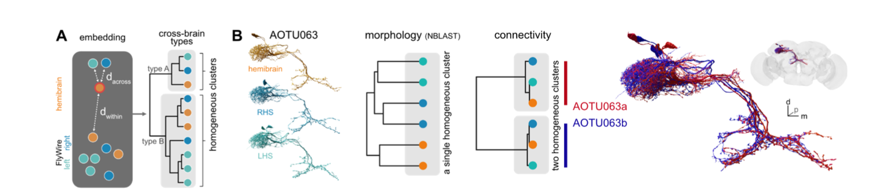

# 3. Splitting AOTU063 cell type

## Intro

In Fig 6 of our manuscript [Schlegel et al
2023](https://doi.org/10.1101/2023.06.27.546055) we show an example of
across-dataset cell typing using AOTU063 as an example.



Fig 6A Schlegel et al 2023 bioRxiv

We should be able to recapitulate the basic features of this analysis
here.

``` r
library(coconatfly)
library(dplyr)
```

For this analysis we will use the version 630 connectivity / annotation
data released in June 2023. We will set an option use the lower level
fafbseg package to ensure this. You may need to download the relevant
data dumps if you have not done so previously.

``` r
fafbseg::download_flywire_release_data(version = 630)
#> Checking for connectivity files to download
#> Checking for annotation files to download
#> Loading required namespace: git2r
```

``` r
fafbseg::flywire_connectome_data_version(set = 630)
```

``` r
aotu63=cf_meta(cf_ids(query = '/type:AOTU063.*', datasets = c("flywire","hemibrain")))
aotu63
#>                   id side   class subclass subsubclass     type
#> 1 720575940620326253    R central     <NA>        <NA> AOTU063a
#> 2 720575940618697118    L central     <NA>        <NA> AOTU063b
#> 3 720575940621925631    R central     <NA>        <NA> AOTU063b
#> 4 720575940631129362    L central     <NA>        <NA> AOTU063a
#> 5          791039731    R    <NA>     <NA>        <NA>  AOTU063
#> 6          800929667    R    <NA>     <NA>        <NA>  AOTU063
#>            lineage group          instance   dataset                   key
#> 1 putative_primary  <NA>        AOTU063a_R   flywire fw:720575940620326253
#> 2 putative_primary  <NA>        AOTU063b_L   flywire fw:720575940618697118
#> 3 putative_primary  <NA>        AOTU063b_R   flywire fw:720575940621925631
#> 4 putative_primary  <NA>        AOTU063a_L   flywire fw:720575940631129362
#> 5             <NA>  <NA> AOTU063(SCB058)_R hemibrain          hb:791039731
#> 6             <NA>  <NA> AOTU063(SCB058)_R hemibrain          hb:800929667
```

``` r
aotu63 %>%
  cf_cosine_plot()
#> Matching types across datasets. Keeping 247/445 output connections with total weight 7771/11012 (71%)
#> Matching types across datasets. Keeping 660/1082 input connections with total weight 13072/18107 (72%)
```


We can get the dendrogram for this clustering

``` r
aotu63.hc = cf_cosine_plot(aotu63, heatmap = FALSE)
#> Matching types across datasets. Keeping 247/445 output connections with total weight 7771/11012 (71%)
#> Matching types across datasets. Keeping 660/1082 input connections with total weight 13072/18107 (72%)
plot(aotu63.hc)
```


And then cut it in two and extract those two clusters using the
[`coconat::add_cluster_info()`](https://natverse.org/coconat/reference/add_cluster_info.html)
helper function.

``` r
aotu63=coconat::add_cluster_info(aotu63, dend=aotu63.hc, k=2)
#> Warning in coconat::add_cluster_info(aotu63, dend = aotu63.hc, k = 2): Multiple standard id columns are present in aotu63
#> Choosing key
aotu63 %>% 
  select(side, type, dataset, group_k2, key) %>% 
  arrange(group_k2, side)
#>   side     type   dataset group_k2                   key
#> 1    L AOTU063a   flywire        1 fw:720575940631129362
#> 2    R AOTU063a   flywire        1 fw:720575940620326253
#> 3    R  AOTU063 hemibrain        1          hb:800929667
#> 4    L AOTU063b   flywire        2 fw:720575940618697118
#> 5    R AOTU063b   flywire        2 fw:720575940621925631
#> 6    R  AOTU063 hemibrain        2          hb:791039731
```

So from this we can see that group 2 seems to the “b” type.

## Finding the partners that define the types

What might distinguish these two types? We can fetch, say, the input
partners, and then look at how connection strength varies across the
types.

To get started let’s redefine the type of our 6 query neurons based on
the clustering. Then fetch the input partners and merge in the the
AOTU063 type (i.e. AOTU063a or AOTU063b) as a new column called `qtype`

``` r
aotu63v2=aotu63 %>% 
  mutate(type=case_when(
    group_k2==1 ~ 'AOTU063a',
    group_k2==2 ~ 'AOTU063b'
  ))
aotu63in <- cf_partners(aotu63, partners = 'in', threshold = 10)
aotu63in
#> # A tibble: 657 × 8
#>     pre_id post_id weight side  type    dataset pre_key               post_key  
#>    <int64> <int64>  <int> <chr> <chr>   <chr>   <chr>                 <chr>     
#>  1    7e17    7e17    118 R     LT52    flywire fw:720575940640004174 fw:720575…
#>  2    7e17    7e17    109 R     LT52    flywire fw:720575940618982725 fw:720575…
#>  3    7e17    7e17    109 R     AOTU041 flywire fw:720575940627738640 fw:720575…
#>  4    7e17    7e17     96 L     LT52    flywire fw:720575940612465777 fw:720575…
#>  5    7e17    7e17     95 R     LT52    flywire fw:720575940612837811 fw:720575…
#>  6    7e17    7e17     90 L     AOTU042 flywire fw:720575940619453861 fw:720575…
#>  7    7e17    7e17     87 R     SIP034  flywire fw:720575940628728172 fw:720575…
#>  8    7e17    7e17     83 R     LT52    flywire fw:720575940626024336 fw:720575…
#>  9    7e17    7e17     83 R     AOTU041 flywire fw:720575940638668659 fw:720575…
#> 10    7e17    7e17     82 R     AOTU014 flywire fw:720575940620321158 fw:720575…
#> # ℹ 647 more rows
```

``` r
# note that AOTU063 neurons will be the postsynaptic partners in this dataframe
aotu63in <- aotu63in %>% 
  left_join(
    aotu63v2 %>% mutate(qtype=type) %>% select(qtype, key),
    by=c("post_key"='key'))
aotu63in %>% 
  select(weight, type, qtype)
#> # A tibble: 657 × 3
#>    weight type    qtype   
#>     <int> <chr>   <chr>   
#>  1    118 LT52    AOTU063b
#>  2    109 LT52    AOTU063b
#>  3    109 AOTU041 AOTU063a
#>  4     96 LT52    AOTU063b
#>  5     95 LT52    AOTU063b
#>  6     90 AOTU042 AOTU063a
#>  7     87 SIP034  AOTU063a
#>  8     83 LT52    AOTU063b
#>  9     83 AOTU041 AOTU063a
#> 10     82 AOTU014 AOTU063b
#> # ℹ 647 more rows
```

Ok with that preparatory work we can now make a summary of the inputs
across the different types and datasets. This pipeline is a little more
involved, but I have commented extensively and if you follow step by
step it does make sense.

``` r
aotu63in %>% 
  mutate(dataset=abbreviate_datasets(dataset)) %>% 
  # FlyWire has e.g. LC10a LC10c annotated, but not hemibrain
  mutate(type=case_when(
    grepl("LC10", type) ~ "LC10",
    T ~ type
  )) %>% 
  # summarise the connection strength by query cell type, data set 
  # and partner (downstream) cell type
  group_by(qtype, dataset, type) %>% 
  summarise(weight=sum(weight)) %>% 
  # sort with strongest partners first
  arrange(desc(weight)) %>% 
  # make four columns, one for each query type / dataset combination 
  tidyr::pivot_wider(
    names_from = c(qtype, dataset), 
    values_from = weight, 
    values_fill = 0) %>% 
  # convert from synaptic counts to percentages of total input
  mutate(across(-type, ~round(100*.x/sum(.x))))
#> `summarise()` has regrouped the output.
#> ℹ Summaries were computed grouped by qtype, dataset, and type.
#> ℹ Output is grouped by qtype and dataset.
#> ℹ Use `summarise(.groups = "drop_last")` to silence this message.
#> ℹ Use `summarise(.by = c(qtype, dataset, type))` for per-operation grouping
#>   (`?dplyr::dplyr_by`) instead.
#> # A tibble: 49 × 5
#>    type    AOTU063a_fw AOTU063b_fw AOTU063a_hb AOTU063b_hb
#>    <chr>         <dbl>       <dbl>       <dbl>       <dbl>
#>  1 LC10             56          48          56          45
#>  2 LT52              7          30          11          26
#>  3 SIP034            7           0           5           0
#>  4 NA                6           3           0           0
#>  5 AOTU041           5           2           5           1
#>  6 AOTU042           4           3           3           2
#>  7 AOTU014           0           5           0           5
#>  8 VES041            3           0           3           0
#>  9 AOTU065           2           1           2           2
#> 10 AOTU028           2           0           2           0
#> # ℹ 39 more rows
```

So we can see that the top few cell types already suggest a number of
likely explanations.

For example LC10 provides 10% more input for AOTU063a vs AOTU063b while
LT52 input is much stronger for AOTU063b than AOTU063a. Crucially these
patterns are consistent across datasets.

### Distinctive output partners

``` r
aotu63out <- cf_partners(aotu63, partners = 'out', threshold = 10)

aotu63out <- aotu63out %>% 
  left_join(
    aotu63v2 %>% mutate(qtype=type) %>% select(qtype, key),
    by=c("pre_key"='key'))

aotu63out %>% 
  mutate(dataset=abbreviate_datasets(dataset)) %>% 
  # FlyWire has e.g. LC10a LC10c annotated, but not hemibrain
  mutate(type=case_when(
    grepl("LC10", type) ~ "LC10",
    T ~ type
  )) %>% 
  group_by(qtype, dataset, type) %>% 
  summarise(weight=sum(weight)) %>% 
  arrange(desc(weight)) %>% 
  tidyr::pivot_wider(names_from = c(qtype, dataset), values_from = weight, values_fill = 0) %>% 
  # convert from raw to pct
  mutate(across(-type, ~round(100*.x/sum(.x))))
#> `summarise()` has regrouped the output.
#> ℹ Summaries were computed grouped by qtype, dataset, and type.
#> ℹ Output is grouped by qtype and dataset.
#> ℹ Use `summarise(.groups = "drop_last")` to silence this message.
#> ℹ Use `summarise(.by = c(qtype, dataset, type))` for per-operation grouping
#>   (`?dplyr::dplyr_by`) instead.
#> # A tibble: 77 × 5
#>    type    AOTU063a_fw AOTU063b_fw AOTU063a_hb AOTU063b_hb
#>    <chr>         <dbl>       <dbl>       <dbl>       <dbl>
#>  1 IB008            15          11          14           9
#>  2 DNa10            12          11           9           7
#>  3 IB010            11           5           8           5
#>  4 AOTU007           8           7           6           8
#>  5 DNde002           3           9           0           0
#>  6 VES064            7           4           5           4
#>  7 DNae011           7           3           0           0
#>  8 DNbe004           6           0           0           0
#>  9 NA                5           0           0           0
#> 10 AOTU024           1           6           1           2
#> # ℹ 67 more rows
```

Here things are not quite obvious but IB008/IB010 look different and
some of the newly defined DNs in FlyWire like DNde002/DNbe004/DNae011
look like they might be interesting.
