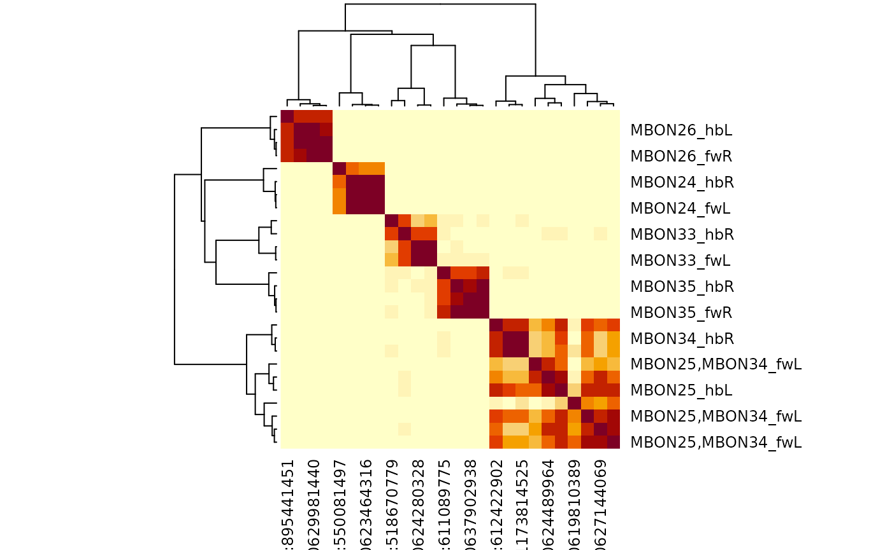

# 1. Getting started with coconatfly

## Setup for brain connectome data.

At the time of writing the main datasets of interest for coconatfly will
be the hemibrain and flywire. Installing coconatfly will automatically
install the natverse packages required for analysis. However, a few
extra steps are still required.

``` r
# first install coconatfly
if(!requireNamespace('natmanager'))
  install.packages('natmanager')
natmanager::install(pkgs = 'coconatfly')
# then get flywire data
fafbseg::download_flywire_release_data()
```

If you have not already done so, you will also need to record a neuprint
token to access hemibrain data. Go to
<https://neuprint.janelia.org/account>, copy your Auth Token and then
edit your R environ file to do

``` r
usethis::edit_r_environ()
```

and add a line like this:

    neuprint_token="eyJhbH0lc9OqzJ6evvcJ23KmIi.eyJlb6B8nUg8senJO1ZVzHb6uQ1fvncAiWdFcTIwTQb0xOcxa3TjKHVdLZ5OAtHzjWJJLqpQjiTikWryIfgUHCKoq31RSdDMqD7mah0RWCFaEPrTDdPm7OfRBizNdoqyyWAE61g9FWb2CAh8kAfcsb3ylVG3MwFOYpX91ayWxtp1prfjtm9dte9mFddGdWdr8444Rrun8cLksyELl93utdnGAQReSgiNy-jDLujyRCSRCAOq23X049gRA9QtJcOKCDtdiFyQhMKzLk8EISt7Cnn9AS1"

Replacing with your auth token and being sure that is all on one line
with a line break after the last quotation mark.

## Set up for VNC data

For VNC data, the main datasets are FANC and MANC. MANC data will be
available if you have set up your neuprint access token as described in
the brain section. For FANC data you will need a separate *CAVE* access
token. Essentially this is covered by:

``` r
fancr::fanc_set_token()
# check all is good
fancr::dr_fanc()
```

## Dataset status

You can get a useful overview of the current status of your access to
different datasets with the
[`dr_coconatfly()`](https://natverse.org/coconatfly/reference/dr_coconatfly.md)
command.

``` r
library(coconatfly)
dr_coconatfly()
#> Warning in system2(python, args, stdout = TRUE): running command
#> ''/home/runner/.cache/R/reticulate/uv/cache/archive-v0/XhX8xB4ErCPil7wgOvMYz/bin/python'
#> -m pip freeze' had status 1
#> Warning in system2(python, args, stdout = TRUE): running command
#> ''/home/runner/.cache/R/reticulate/uv/cache/archive-v0/XhX8xB4ErCPil7wgOvMYz/bin/python'
#> -m pip freeze' had status 1
#>     dataset installed
#> 1 hemibrain      TRUE
#> 2      manc      TRUE
#> 3   malecns      TRUE
#> 4 opticlobe      TRUE
#> 5   flywire      TRUE
#> 6      fanc      TRUE
#> 7      banc      TRUE
#>                                                                      server
#> 1                                              https://neuprint.janelia.org
#> 2                                              https://neuprint.janelia.org
#> 3                                              https://neuprint.janelia.org
#> 4                                              https://neuprint.janelia.org
#> 5                                                                local dump
#> 6                                                                      <NA>
#> 7 middleauth+https://cave.fanc-fly.com/segmentation/table/wclee_fly_cns_001
#>             version
#> 1  hemibrain:v1.2.1
#> 2       manc:v1.2.3
#> 3     male-cns:v0.9
#> 4 optic-lobe:v1.0.1
#> 5               783
#> 6              <NA>
#> 7              <NA>
#> For additional information (inc auth issues) for flywire or fanc datasets, try:
#>  `fafbseg::dr_fafbseg()` or  `fancr::dr_fanc()`
```

## Brain example

Ok with that in place, let’s check if we can use connectome data,
starting with the brain.

``` r
library(coconatfly)
library(dplyr)
```

We use [`cf_ids()`](https://natverse.org/coconatfly/reference/cf_ids.md)
to specify neurons in different datasets:

``` r
cf_ids(hemibrain = 'ORN_DA2', expand = TRUE)
#> hemibrain [35 ids]: 1669017843 1669699714 1669946117 1670382036 1670386270 1670390647 1669358817 1671659809 1702107389 1702802179 ...
```

We can ask for the same specific cell type across datasets, here MBON01,
mushroom body output neuron 1 (aka M6 or MBON-gamma5beta’2a).

``` r
cf_meta(cf_ids('MBON01', datasets = c("flywire", "hemibrain")))
#> Loading required namespace: git2r
#>                   id side   class subclass subsubclass   type          lineage
#> 1 720575940624117245    R central     MBON        <NA> MBON01 putative_primary
#> 2 720575940643309197    L central     MBON        <NA> MBON01 putative_primary
#> 3          612371421    R    <NA>     <NA>        <NA> MBON01            ADM07
#> 4          673509195    L    <NA>     <NA>        <NA> MBON01            ADM07
#>   group         instance   dataset                   key
#> 1  <NA>         MBON01_R   flywire fw:720575940624117245
#> 2  <NA>         MBON01_L   flywire fw:720575940643309197
#> 3  <NA> MBON01(y5B'2a)_R hemibrain          hb:612371421
#> 4  <NA> MBON01(y5B'2a)_L hemibrain          hb:673509195
```

We can do a regular expression query returning all MBONs:

``` r
mbonmeta=cf_meta(cf_ids('/type:MBON.+', datasets = c("flywire", "hemibrain")))
mbonmeta
#>                     id side   class subclass subsubclass          type
#> 1   720575940624185095    L central     MBON        <NA>        MBON02
#> 2   720575940624117245    R central     MBON        <NA>        MBON01
#> 3   720575940638526278    R central     MBON        <NA>        MBON32
#> 4   720575940629585602    R central     MBON        <NA>        MBON10
#> 5   720575940637934308    R central     MBON        <NA>        MBON30
#> 6   720575940632118343    L central     MBON        <NA>        MBON10
#> 7   720575940609959637    L central     MBON        <NA>        MBON32
#> 8   720575940638163428    L central     MBON        <NA>        MBON06
#> 9   720575940630496374    R central     MBON        <NA>        MBON05
#> 10  720575940642142861    L central     MBON        <NA>        MBON10
#> 11  720575940611344078    R central     MBON        <NA>        MBON20
#> 12  720575940634822751    R central     MBON        <NA>   MBON17-like
#> 13  720575940617552340    R central     MBON        <NA>        MBON02
#> 14  720575940624280328    R central     MBON        <NA>        MBON33
#> 15  720575940617567206    L central     MBON        <NA>        MBON23
#> 16  720575940643700640    R central     MBON        <NA>        MBON29
#> 17  720575940615221811    R central     MBON        <NA>        MBON10
#> 18  720575940614026193    R central     MBON        <NA>        MBON14
#> 19  720575940633209647    L central     MBON        <NA>        MBON10
#> 20  720575940623001480    R central     MBON        <NA>        MBON12
#> 21  720575940608304220    R central     MBON        <NA>   MBON15-like
#> 22  720575940614595218    L central     MBON        <NA>        MBON28
#> 23  720575940636992368    R central     MBON        <NA>        MBON31
#> 24  720575940621828443    L central     MBON        <NA>        MBON12
#> 25  720575940637902938    L central     MBON        <NA>        MBON35
#> 26  720575940638774606    L central     MBON        <NA>        MBON17
#> 27  720575940639697827    R central     MBON        <NA>        MBON14
#> 28  720575940626833021    L central     MBON        <NA>        MBON19
#> 29  720575940618008859    L central     MBON        <NA>        MBON30
#> 30  720575940635841143    L central     MBON        <NA>        MBON15
#> 31  720575940618249797    R central     MBON        <NA>        MBON27
#> 32  720575940629856515    L central     MBON        <NA>        MBON09
#> 33  720575940623905719    R central     MBON        <NA>        MBON12
#> 34  720575940629529722    L central     MBON        <NA>        MBON10
#> 35  720575940624659943    L central     MBON        <NA> MBON25,MBON34
#> 36  720575940624590316    R central     MBON        <NA>        MBON03
#> 37  720575940645304430    L central     MBON        <NA>        MBON13
#> 38  720575940612196850    R central     MBON        <NA>   MBON15-like
#> 39  720575940630767959    L central     MBON        <NA>        MBON15
#> 40  720575940635082347    L central     MBON        <NA>   MBON15-like
#> 41  720575940628757547    L central     MBON        <NA>   MBON15-like
#> 42  720575940627144069    R central     MBON        <NA> MBON25,MBON34
#> 43  720575940610647416    R central     MBON        <NA>        MBON10
#> 44  720575940622093436    R central     MBON        <NA>        MBON15
#> 45  720575940624696810    L central     MBON        <NA>   MBON15-like
#> 46  720575940629422086    L central     MBON        <NA>        MBON09
#> 47  720575940647328900    R central     MBON        <NA>        MBON10
#> 48  720575940650386553    L central     MBON        <NA>   MBON17-like
#> 49  720575940639556467    R central     MBON        <NA>        MBON10
#> 50  720575940612455338    R central     MBON        <NA>        MBON15
#> 51  720575940617749538    R central     MBON        <NA>        MBON11
#> 52  720575940617760257    R central     MBON        <NA>        MBON17
#> 53  720575940619810389    R central     MBON        <NA> MBON25,MBON34
#> 54  720575940634482783    R central     MBON        <NA>        MBON19
#> 55  720575940644615716    L central     MBON        <NA>        MBON31
#> 56  720575940626109315    R central     MBON        <NA>        MBON19
#> 57  720575940623377802    L central     MBON        <NA>        MBON16
#> 58  720575940626744921    R central     MBON        <NA>        MBON16
#> 59  720575940623464316    R central     MBON        <NA>        MBON24
#> 60  720575940622979277    L central     MBON        <NA>        MBON27
#> 61  720575940614892182    R central     MBON        <NA>        MBON28
#> 62  720575940620715224    L central     MBON        <NA>        MBON21
#> 63  720575940643863496    L central     MBON        <NA>        MBON20
#> 64  720575940621777391    R central     MBON        <NA>        MBON21
#> 65  720575940606953858    R central     MBON        <NA>        MBON23
#> 66  720575940630075703    L central     MBON        <NA>        MBON12
#> 67  720575940652390134    L central     MBON        <NA>        MBON07
#> 68  720575940632535756    L central     MBON        <NA>        MBON14
#> 69  720575940643696288    L central     MBON        <NA>        MBON14
#> 70  720575940623201833    L central     MBON        <NA>        MBON11
#> 71  720575940635063135    R central     MBON        <NA>        MBON22
#> 72  720575940616463477    L central     MBON        <NA>        MBON22
#> 73  720575940629981440    L central     MBON        <NA>        MBON26
#> 74  720575940623182847    L central     MBON        <NA>        MBON33
#> 75  720575940626315010    R central     MBON        <NA>        MBON13
#> 76  720575940632943277    R central     MBON        <NA>        MBON35
#> 77  720575940624539284    L central     MBON        <NA>        MBON18
#> 78  720575940620464321    L central     MBON        <NA>        MBON04
#> 79  720575940628783363    R central     MBON        <NA>        MBON07
#> 80  720575940643309197    L central     MBON        <NA>        MBON01
#> 81  720575940614392999    L central     MBON        <NA>        MBON29
#> 82  720575940617302365    L central     MBON        <NA>        MBON07
#> 83  720575940622997453    R central     MBON        <NA>        MBON18
#> 84  720575940624694503    L central     MBON        <NA>        MBON03
#> 85  720575940628734376    R central     MBON        <NA>        MBON04
#> 86  720575940610964946    R central     MBON        <NA>        MBON09
#> 87  720575940607155890    R central     MBON        <NA>        MBON26
#> 88  720575940623381956    R central     MBON        <NA>        MBON07
#> 89  720575940630864847    R central     MBON        <NA>        MBON09
#> 90  720575940638028607    R central     MBON        <NA>        MBON06
#> 91  720575940621164720    L central     MBON        <NA>        MBON05
#> 92  720575940623841463    L central     MBON        <NA>        MBON19
#> 93  720575940631177803    L central     MBON        <NA>        MBON24
#> 94  720575940624489964    R central     MBON        <NA> MBON25,MBON34
#> 95  720575940616398303    L central     MBON        <NA> MBON25,MBON34
#> 96  720575940623750325    L central     MBON        <NA> MBON25,MBON34
#> 97           612371421    R    <NA>     <NA>        <NA>        MBON01
#> 98           673509195    L    <NA>     <NA>        <NA>        MBON01
#> 99           424789697    R    <NA>     <NA>        <NA>        MBON02
#> 100         5813022341    L    <NA>     <NA>        <NA>        MBON02
#> 101          487925037    R    <NA>     <NA>        <NA>        MBON03
#> 102          612738462    L    <NA>     <NA>        <NA>        MBON03
#> 103          487925063    R    <NA>     <NA>        <NA>        MBON04
#> 104          613079053    L    <NA>     <NA>        <NA>        MBON04
#> 105         1386512867    R    <NA>     <NA>        <NA>        MBON05
#> 106          799586652    L    <NA>     <NA>        <NA>        MBON05
#> 107          422725634    L    <NA>     <NA>        <NA>        MBON06
#> 108         5813061512    R    <NA>     <NA>        <NA>        MBON06
#> 109         1234386037    R    <NA>     <NA>        <NA>        MBON07
#> 110          611477605    L    <NA>     <NA>        <NA>        MBON07
#> 111          733036127    R    <NA>     <NA>        <NA>        MBON07
#> 112          920470959    L    <NA>     <NA>        <NA>        MBON07
#> 113         1016835041    L    <NA>     <NA>        <NA>        MBON09
#> 114         1048215779    L    <NA>     <NA>        <NA>        MBON09
#> 115         1078693835    R    <NA>     <NA>        <NA>        MBON09
#> 116          613719036    R    <NA>     <NA>        <NA>        MBON10
#> 117          672352543    R    <NA>     <NA>        <NA>        MBON10
#> 118          768555687    R    <NA>     <NA>        <NA>        MBON10
#> 119          424767514    R    <NA>     <NA>        <NA>        MBON11
#> 120          517518166    L    <NA>     <NA>        <NA>        MBON11
#> 121          704466265    R    <NA>     <NA>        <NA>        MBON12
#> 122          861665641    R    <NA>     <NA>        <NA>        MBON12
#> 123         1139667240    R    <NA>     <NA>        <NA>        MBON13
#> 124          300972942    R    <NA>     <NA>        <NA>        MBON14
#> 125          394225044    L    <NA>     <NA>        <NA>        MBON14
#> 126         5813067721    L    <NA>     <NA>        <NA>        MBON14
#> 127         5813068729    R    <NA>     <NA>        <NA>        MBON14
#> 128          642664141    R    <NA>     <NA>        <NA>        MBON15
#> 129          673702721    R    <NA>     <NA>        <NA>        MBON15
#> 130          457175171    R    <NA>     <NA>        <NA>   MBON15-like
#> 131          579916831    R    <NA>     <NA>        <NA>   MBON15-like
#> 132          673366098    R    <NA>     <NA>        <NA>        MBON16
#> 133         5812981264    R    <NA>     <NA>        <NA>        MBON17
#> 134         5812981543    R    <NA>     <NA>        <NA>   MBON17-like
#> 135          457196444    L    <NA>     <NA>        <NA>        MBON18
#> 136         5813020828    R    <NA>     <NA>        <NA>        MBON18
#> 137          423774471    R    <NA>     <NA>        <NA>        MBON19
#> 138          517854468    R    <NA>     <NA>        <NA>        MBON19
#> 139          792368888    R    <NA>     <NA>        <NA>        MBON20
#> 140         5813022896    R    <NA>     <NA>        <NA>        MBON21
#> 141          985813153    L    <NA>     <NA>        <NA>        MBON21
#> 142         5813042659    R    <NA>     <NA>        <NA>        MBON22
#> 143          985131499    L    <NA>     <NA>        <NA>        MBON22
#> 144          423382015    R    <NA>     <NA>        <NA>        MBON23
#> 145          487143497    R    <NA>     <NA>        <NA>        MBON24
#> 146          550081497    L    <NA>     <NA>        <NA>        MBON24
#> 147          612742248    L    <NA>     <NA>        <NA>        MBON25
#> 148          612422902    R    <NA>     <NA>        <NA>        MBON25
#> 149          912951014    L    <NA>     <NA>        <NA>        MBON26
#> 150          895441451    R    <NA>     <NA>        <NA>        MBON26
#> 151         5813061538    L    <NA>     <NA>        <NA>        MBON27
#> 152         5813117385    R    <NA>     <NA>        <NA>        MBON27
#> 153          457196643    R    <NA>     <NA>        <NA>        MBON28
#> 154         5813058048    R    <NA>     <NA>        <NA>        MBON29
#> 155         5813052909    L    <NA>     <NA>        <NA>        MBON29
#> 156         5813022234    R    <NA>     <NA>        <NA>        MBON30
#> 157         5813040205    L    <NA>     <NA>        <NA>        MBON30
#> 158          706948318    L    <NA>     <NA>        <NA>        MBON31
#> 159          894020730    R    <NA>     <NA>        <NA>        MBON31
#> 160          642732835    R    <NA>     <NA>        <NA>        MBON32
#> 161          643847447    L    <NA>     <NA>        <NA>        MBON32
#> 162          518670779    L    <NA>     <NA>        <NA>        MBON33
#> 163          547552266    R    <NA>     <NA>        <NA>        MBON33
#> 164         1173814525    L    <NA>     <NA>        <NA>        MBON34
#> 165         5813033000    R    <NA>     <NA>        <NA>        MBON34
#> 166          518930199    R    <NA>     <NA>        <NA>        MBON35
#> 167          611089775    L    <NA>     <NA>        <NA>        MBON35
#>              lineage group                    instance   dataset
#> 1   putative_primary  <NA>                    MBON02_L   flywire
#> 2   putative_primary  <NA>                    MBON01_R   flywire
#> 3   putative_primary  <NA>                    MBON32_R   flywire
#> 4               EBa1  <NA>                    MBON10_R   flywire
#> 5   putative_primary  <NA>                    MBON30_R   flywire
#> 6               EBa1  <NA>                    MBON10_L   flywire
#> 7   putative_primary  <NA>                    MBON32_L   flywire
#> 8   putative_primary  <NA>                    MBON06_L   flywire
#> 9   putative_primary  <NA>                    MBON05_R   flywire
#> 10              EBa1  <NA>                    MBON10_L   flywire
#> 11  putative_primary  <NA>                    MBON20_R   flywire
#> 12        DL1_dorsal  <NA>               MBON17-like_R   flywire
#> 13  putative_primary  <NA>                    MBON02_R   flywire
#> 14  putative_primary  <NA>                    MBON33_R   flywire
#> 15        DL1_dorsal  <NA>                    MBON23_L   flywire
#> 16       DL2_ventral  <NA>                    MBON29_R   flywire
#> 17              EBa1  <NA>                    MBON10_R   flywire
#> 18             FLAa2  <NA>                    MBON14_R   flywire
#> 19              EBa1  <NA>                    MBON10_L   flywire
#> 20             FLAa2  <NA>                    MBON12_R   flywire
#> 21        DL1_dorsal  <NA>               MBON15-like_R   flywire
#> 22        DL1_dorsal  <NA>                    MBON28_L   flywire
#> 23  putative_primary  <NA>                    MBON31_R   flywire
#> 24             FLAa2  <NA>                    MBON12_L   flywire
#> 25  putative_primary  <NA>                    MBON35_L   flywire
#> 26        DL1_dorsal  <NA>                    MBON17_L   flywire
#> 27             FLAa2  <NA>                    MBON14_R   flywire
#> 28        DL1_dorsal  <NA>                    MBON19_L   flywire
#> 29  putative_primary  <NA>                    MBON30_L   flywire
#> 30        DL1_dorsal  <NA>                    MBON15_L   flywire
#> 31  putative_primary  <NA>                    MBON27_R   flywire
#> 32  putative_primary  <NA>                    MBON09_L   flywire
#> 33             FLAa2  <NA>                    MBON12_R   flywire
#> 34              EBa1  <NA>                    MBON10_L   flywire
#> 35            SMPad3  <NA>             MBON25,MBON34_L   flywire
#> 36  putative_primary  <NA>                    MBON03_R   flywire
#> 37             FLAa2  <NA>                    MBON13_L   flywire
#> 38        DL1_dorsal  <NA>               MBON15-like_R   flywire
#> 39        DL1_dorsal  <NA>                    MBON15_L   flywire
#> 40        DL1_dorsal  <NA>               MBON15-like_L   flywire
#> 41        DL1_dorsal  <NA>               MBON15-like_L   flywire
#> 42            SMPad3  <NA>             MBON25,MBON34_R   flywire
#> 43              EBa1  <NA>                    MBON10_R   flywire
#> 44        DL1_dorsal  <NA>                    MBON15_R   flywire
#> 45        DL1_dorsal  <NA>               MBON15-like_L   flywire
#> 46  putative_primary  <NA>                    MBON09_L   flywire
#> 47              EBa1  <NA>                    MBON10_R   flywire
#> 48        DL1_dorsal  <NA>               MBON17-like_L   flywire
#> 49              EBa1  <NA>                    MBON10_R   flywire
#> 50        DL1_dorsal  <NA>                    MBON15_R   flywire
#> 51  putative_primary  <NA>                    MBON11_R   flywire
#> 52        DL1_dorsal  <NA>                    MBON17_R   flywire
#> 53            SMPad3  <NA>             MBON25,MBON34_R   flywire
#> 54        DL1_dorsal  <NA>                    MBON19_R   flywire
#> 55  putative_primary  <NA>                    MBON31_L   flywire
#> 56        DL1_dorsal  <NA>                    MBON19_R   flywire
#> 57        DL1_dorsal  <NA>                    MBON16_L   flywire
#> 58        DL1_dorsal  <NA>                    MBON16_R   flywire
#> 59  putative_primary  <NA>                    MBON24_R   flywire
#> 60  putative_primary  <NA>                    MBON27_L   flywire
#> 61        DL1_dorsal  <NA>                    MBON28_R   flywire
#> 62  putative_primary  <NA>                    MBON21_L   flywire
#> 63  putative_primary  <NA>                    MBON20_L   flywire
#> 64  putative_primary  <NA>                    MBON21_R   flywire
#> 65        DL1_dorsal  <NA>                    MBON23_R   flywire
#> 66             FLAa2  <NA>                    MBON12_L   flywire
#> 67  putative_primary  <NA>                    MBON07_L   flywire
#> 68             FLAa2  <NA>                    MBON14_L   flywire
#> 69             FLAa2  <NA>                    MBON14_L   flywire
#> 70  putative_primary  <NA>                    MBON11_L   flywire
#> 71  putative_primary  <NA>                    MBON22_R   flywire
#> 72  putative_primary  <NA>                    MBON22_L   flywire
#> 73  putative_primary  <NA>                    MBON26_L   flywire
#> 74  putative_primary  <NA>                    MBON33_L   flywire
#> 75             FLAa2  <NA>                    MBON13_R   flywire
#> 76  putative_primary  <NA>                    MBON35_R   flywire
#> 77        DL1_dorsal  <NA>                    MBON18_L   flywire
#> 78  putative_primary  <NA>                    MBON04_L   flywire
#> 79  putative_primary  <NA>                    MBON07_R   flywire
#> 80  putative_primary  <NA>                    MBON01_L   flywire
#> 81       DL2_ventral  <NA>                    MBON29_L   flywire
#> 82  putative_primary  <NA>                    MBON07_L   flywire
#> 83        DL1_dorsal  <NA>                    MBON18_R   flywire
#> 84  putative_primary  <NA>                    MBON03_L   flywire
#> 85  putative_primary  <NA>                    MBON04_R   flywire
#> 86  putative_primary  <NA>                    MBON09_R   flywire
#> 87  putative_primary  <NA>                    MBON26_R   flywire
#> 88  putative_primary  <NA>                    MBON07_R   flywire
#> 89  putative_primary  <NA>                    MBON09_R   flywire
#> 90  putative_primary  <NA>                    MBON06_R   flywire
#> 91  putative_primary  <NA>                    MBON05_L   flywire
#> 92        DL1_dorsal  <NA>                    MBON19_L   flywire
#> 93  putative_primary  <NA>                    MBON24_L   flywire
#> 94            SMPad3  <NA>             MBON25,MBON34_R   flywire
#> 95            SMPad3  <NA>             MBON25,MBON34_L   flywire
#> 96            SMPad3  <NA>             MBON25,MBON34_L   flywire
#> 97             ADM07  <NA>            MBON01(y5B'2a)_R hemibrain
#> 98             ADM07  <NA>            MBON01(y5B'2a)_L hemibrain
#> 99             ADM07  <NA>            MBON02(B2B'2a)_R hemibrain
#> 100            ADM07  <NA>            MBON02(B2B'2a)_L hemibrain
#> 101            ADM07  <NA>             MBON03(B'2mp)_R hemibrain
#> 102            ADM07  <NA>             MBON03(B'2mp)_L hemibrain
#> 103            ADM07  <NA>   MBON04(B'2mp_bilateral)_R hemibrain
#> 104            ADM07  <NA>   MBON04(B'2mp_bilateral)_L hemibrain
#> 105            AVM07  <NA>           MBON05(y4>y1y2)_R hemibrain
#> 106             <NA>  <NA>    MBON05(y4>y1y2)(AVM07)_L hemibrain
#> 107             <NA>  <NA>       MBON06(B1>a)(AVM07)_L hemibrain
#> 108            AVM07  <NA>              MBON06(B1>a)_R hemibrain
#> 109             <NA>  <NA>                MBON07(a1)_R hemibrain
#> 110             <NA>  <NA>                MBON07(a1)_L hemibrain
#> 111            ADM10  <NA>                MBON07(a1)_R hemibrain
#> 112             <NA>  <NA>                MBON07(a1)_L hemibrain
#> 113             <NA>  <NA>      MBON09(y3B'1)(AVM17)_L hemibrain
#> 114             <NA>  <NA>      MBON09(y3B'1)(AVM17)_L hemibrain
#> 115            AVM17  <NA>             MBON09(y3B'1)_R hemibrain
#> 116            AVM07  <NA>               MBON10(B'1)_R hemibrain
#> 117            AVM07  <NA>               MBON10(B'1)_R hemibrain
#> 118            AVM07  <NA>               MBON10(B'1)_R hemibrain
#> 119            ADM05  <NA>        MBON11(y1pedc>a/B)_R hemibrain
#> 120             <NA>  <NA> MBON11(y1pedc>a/B)(ADM05)_L hemibrain
#> 121             <NA>  <NA>             MBON12(y2a'1)_R hemibrain
#> 122             <NA>  <NA>             MBON12(y2a'1)_R hemibrain
#> 123             <NA>  <NA>               MBON13(a'2)_R hemibrain
#> 124             <NA>  <NA>                MBON14(a3)_R hemibrain
#> 125             <NA>  <NA>                MBON14(a3)_L hemibrain
#> 126             <NA>  <NA>                MBON14(a3)_L hemibrain
#> 127             <NA>  <NA>                MBON14(a3)_R hemibrain
#> 128            PDL05  <NA>               MBON15(a'1)_R hemibrain
#> 129            PDL05  <NA>               MBON15(a'1)_R hemibrain
#> 130            PDL05  <NA>       MBON15-like(a'1a'2)_R hemibrain
#> 131            PDL05  <NA>       MBON15-like(a'1a'2)_R hemibrain
#> 132            PDL05  <NA>             MBON16(a'3ap)_R hemibrain
#> 133            PDL05  <NA>              MBON17(a'3m)_R hemibrain
#> 134            PDL05  <NA>       MBON17-like(a'2a'3)_R hemibrain
#> 135             <NA>  <NA>       MBON18(a2sc)(PDL05)_L hemibrain
#> 136            PDL05  <NA>              MBON18(a2sc)_R hemibrain
#> 137            PDL05  <NA>             MBON19(a2p3p)_R hemibrain
#> 138            PDL19  <NA>             MBON19(a2p3p)_R hemibrain
#> 139            AVM04  <NA>              MBON20(y1y2)_R hemibrain
#> 140            PVL06  <NA>              MBON21(y4y5)_R hemibrain
#> 141             <NA>  <NA>       MBON21(y4y5)(PVL06)_L hemibrain
#> 142            PVL06  <NA>             MBON22(calyx)_R hemibrain
#> 143             <NA>  <NA>      MBON22(calyx)(PVL06)_L hemibrain
#> 144            PDL05  <NA>              MBON23(a2sp)_R hemibrain
#> 145            PDL05  <NA>              MBON24(B2y5)_R hemibrain
#> 146             <NA>  <NA>       MBON24(B2y5)(PDL05)_L hemibrain
#> 147            ADM07  <NA>              MBON25(y1y2)_L hemibrain
#> 148            ADM07  <NA>              MBON25(y1y2)_R hemibrain
#> 149             <NA>  <NA>       MBON26(B'2d)(PDM28)_L hemibrain
#> 150            PDM28  <NA>              MBON26(B'2d)_R hemibrain
#> 151             <NA>  <NA>        MBON27(y5d)(PVM03)_L hemibrain
#> 152            PVM03  <NA>               MBON27(y5d)_R hemibrain
#> 153            PDL05  <NA>         MBON16-like(a'3a)_R hemibrain
#> 154            PVL06  <NA>              MBON29(y4y5)_R hemibrain
#> 155             <NA>  <NA>       MBON29(y4y5)(PVL06)_L hemibrain
#> 156            AVM07  <NA>            MBON30(y1y2y3)_R hemibrain
#> 157             <NA>  <NA>     MBON30(y1y2y3)(AVM07)_L hemibrain
#> 158             <NA>  <NA>       MBON31(a'1a)(ADM10)_L hemibrain
#> 159            ADM10  <NA>              MBON31(a'1a)_R hemibrain
#> 160            ADM08  <NA>                MBON32(y2)_R hemibrain
#> 161             <NA>  <NA>         MBON32(y2)(ADM08)_L hemibrain
#> 162             <NA>  <NA>       MBON33(y2y3)(ADM05)_L hemibrain
#> 163            ADM05  <NA>              MBON33(y2y3)_R hemibrain
#> 164            ADM07  <NA>                MBON34(y2)_L hemibrain
#> 165            ADM07  <NA>                MBON34(y2)_R hemibrain
#> 166            ADM02  <NA>                MBON35(y2)_R hemibrain
#> 167             <NA>  <NA>                MBON35(y2)_L hemibrain
#>                       key
#> 1   fw:720575940624185095
#> 2   fw:720575940624117245
#> 3   fw:720575940638526278
#> 4   fw:720575940629585602
#> 5   fw:720575940637934308
#> 6   fw:720575940632118343
#> 7   fw:720575940609959637
#> 8   fw:720575940638163428
#> 9   fw:720575940630496374
#> 10  fw:720575940642142861
#> 11  fw:720575940611344078
#> 12  fw:720575940634822751
#> 13  fw:720575940617552340
#> 14  fw:720575940624280328
#> 15  fw:720575940617567206
#> 16  fw:720575940643700640
#> 17  fw:720575940615221811
#> 18  fw:720575940614026193
#> 19  fw:720575940633209647
#> 20  fw:720575940623001480
#> 21  fw:720575940608304220
#> 22  fw:720575940614595218
#> 23  fw:720575940636992368
#> 24  fw:720575940621828443
#> 25  fw:720575940637902938
#> 26  fw:720575940638774606
#> 27  fw:720575940639697827
#> 28  fw:720575940626833021
#> 29  fw:720575940618008859
#> 30  fw:720575940635841143
#> 31  fw:720575940618249797
#> 32  fw:720575940629856515
#> 33  fw:720575940623905719
#> 34  fw:720575940629529722
#> 35  fw:720575940624659943
#> 36  fw:720575940624590316
#> 37  fw:720575940645304430
#> 38  fw:720575940612196850
#> 39  fw:720575940630767959
#> 40  fw:720575940635082347
#> 41  fw:720575940628757547
#> 42  fw:720575940627144069
#> 43  fw:720575940610647416
#> 44  fw:720575940622093436
#> 45  fw:720575940624696810
#> 46  fw:720575940629422086
#> 47  fw:720575940647328900
#> 48  fw:720575940650386553
#> 49  fw:720575940639556467
#> 50  fw:720575940612455338
#> 51  fw:720575940617749538
#> 52  fw:720575940617760257
#> 53  fw:720575940619810389
#> 54  fw:720575940634482783
#> 55  fw:720575940644615716
#> 56  fw:720575940626109315
#> 57  fw:720575940623377802
#> 58  fw:720575940626744921
#> 59  fw:720575940623464316
#> 60  fw:720575940622979277
#> 61  fw:720575940614892182
#> 62  fw:720575940620715224
#> 63  fw:720575940643863496
#> 64  fw:720575940621777391
#> 65  fw:720575940606953858
#> 66  fw:720575940630075703
#> 67  fw:720575940652390134
#> 68  fw:720575940632535756
#> 69  fw:720575940643696288
#> 70  fw:720575940623201833
#> 71  fw:720575940635063135
#> 72  fw:720575940616463477
#> 73  fw:720575940629981440
#> 74  fw:720575940623182847
#> 75  fw:720575940626315010
#> 76  fw:720575940632943277
#> 77  fw:720575940624539284
#> 78  fw:720575940620464321
#> 79  fw:720575940628783363
#> 80  fw:720575940643309197
#> 81  fw:720575940614392999
#> 82  fw:720575940617302365
#> 83  fw:720575940622997453
#> 84  fw:720575940624694503
#> 85  fw:720575940628734376
#> 86  fw:720575940610964946
#> 87  fw:720575940607155890
#> 88  fw:720575940623381956
#> 89  fw:720575940630864847
#> 90  fw:720575940638028607
#> 91  fw:720575940621164720
#> 92  fw:720575940623841463
#> 93  fw:720575940631177803
#> 94  fw:720575940624489964
#> 95  fw:720575940616398303
#> 96  fw:720575940623750325
#> 97           hb:612371421
#> 98           hb:673509195
#> 99           hb:424789697
#> 100         hb:5813022341
#> 101          hb:487925037
#> 102          hb:612738462
#> 103          hb:487925063
#> 104          hb:613079053
#> 105         hb:1386512867
#> 106          hb:799586652
#> 107          hb:422725634
#> 108         hb:5813061512
#> 109         hb:1234386037
#> 110          hb:611477605
#> 111          hb:733036127
#> 112          hb:920470959
#> 113         hb:1016835041
#> 114         hb:1048215779
#> 115         hb:1078693835
#> 116          hb:613719036
#> 117          hb:672352543
#> 118          hb:768555687
#> 119          hb:424767514
#> 120          hb:517518166
#> 121          hb:704466265
#> 122          hb:861665641
#> 123         hb:1139667240
#> 124          hb:300972942
#> 125          hb:394225044
#> 126         hb:5813067721
#> 127         hb:5813068729
#> 128          hb:642664141
#> 129          hb:673702721
#> 130          hb:457175171
#> 131          hb:579916831
#> 132          hb:673366098
#> 133         hb:5812981264
#> 134         hb:5812981543
#> 135          hb:457196444
#> 136         hb:5813020828
#> 137          hb:423774471
#> 138          hb:517854468
#> 139          hb:792368888
#> 140         hb:5813022896
#> 141          hb:985813153
#> 142         hb:5813042659
#> 143          hb:985131499
#> 144          hb:423382015
#> 145          hb:487143497
#> 146          hb:550081497
#> 147          hb:612742248
#> 148          hb:612422902
#> 149          hb:912951014
#> 150          hb:895441451
#> 151         hb:5813061538
#> 152         hb:5813117385
#> 153          hb:457196643
#> 154         hb:5813058048
#> 155         hb:5813052909
#> 156         hb:5813022234
#> 157         hb:5813040205
#> 158          hb:706948318
#> 159          hb:894020730
#> 160          hb:642732835
#> 161          hb:643847447
#> 162          hb:518670779
#> 163          hb:547552266
#> 164         hb:1173814525
#> 165         hb:5813033000
#> 166          hb:518930199
#> 167          hb:611089775
```

and then do some simple summaries on the metadata returned by
[`cf_meta()`](https://natverse.org/coconatfly/reference/cf_meta.md):

``` r
mbonmeta %>% 
  mutate(dss=paste0(abbreviate_datasets(dataset), side)) %>% 
  with(table(type, dss))
#>                dss
#> type            fwL fwR hbL hbR
#>   MBON01          1   1   1   1
#>   MBON02          1   1   1   1
#>   MBON03          1   1   1   1
#>   MBON04          1   1   1   1
#>   MBON05          1   1   1   1
#>   MBON06          1   1   1   1
#>   MBON07          2   2   2   2
#>   MBON09          2   2   2   1
#>   MBON10          4   5   0   3
#>   MBON11          1   1   1   1
#>   MBON12          2   2   0   2
#>   MBON13          1   1   0   1
#>   MBON14          2   2   2   2
#>   MBON15          2   2   0   2
#>   MBON15-like     3   2   0   2
#>   MBON16          1   1   0   1
#>   MBON17          1   1   0   1
#>   MBON17-like     1   1   0   1
#>   MBON18          1   1   1   1
#>   MBON19          2   2   0   2
#>   MBON20          1   1   0   1
#>   MBON21          1   1   1   1
#>   MBON22          1   1   1   1
#>   MBON23          1   1   0   1
#>   MBON24          1   1   1   1
#>   MBON25          0   0   1   1
#>   MBON25,MBON34   3   3   0   0
#>   MBON26          1   1   1   1
#>   MBON27          1   1   1   1
#>   MBON28          1   1   0   1
#>   MBON29          1   1   1   1
#>   MBON30          1   1   1   1
#>   MBON31          1   1   1   1
#>   MBON32          1   1   1   1
#>   MBON33          1   1   1   1
#>   MBON34          0   0   1   1
#>   MBON35          1   1   1   1
```

In general things look quite consistent across sides and datasets
(although some neurons are of course missing from the LHS of the
hemibrain).

### Connectivity clustering

We can then then inspect the situation for MBON25 and MBON34 which have
been combined into a single compound type in FlyWire but were regarded
as two distinct types in hemibrain. Notice that we pipe `%>%` the
dataframe containing metadata to the cf_cosine_plot function via a
`filter` expression which picks out our cell type of interest as well as
few similarly numbered ones. We use output connectivity clustering since
we suspect the downstream cell type interactions are more diagnostic for

``` r
mbonmeta %>% 
  filter(grepl("MBON(25|34|24|26|33|35)", type)) %>% 
  cf_cosine_plot(partners = 'out')
#> Matching types across datasets. Keeping 949/1844 output connections with total weight 25990/42677 (61%)
```


