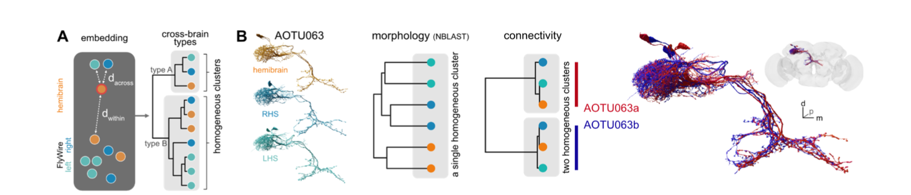

```{r, include = FALSE}
knitr::opts_chunk$set(
  collapse = TRUE,
  comment = "#>"
)
```

## Intro

In Fig 6 of our manuscript [Schlegel et al 2023](https://doi.org/10.1101/2023.06.27.546055) we show an example of across-dataset cell typing using AOTU063 as an example.



We should be able to recapitulate the basic features of this analysis here.

```{r setup}
library(coconatfly)
library(dplyr)
```

```{r}
aotu63=cf_meta(cf_ids(query = '/type:AOTU063.*', datasets = c("flywire","hemibrain")))
aotu63
```

```{r}
aotu63 %>%
  cf_cosine_plot()
```

We can get the dendrogram for this clustering

```{r}
aotu63.hc = cf_cosine_plot(aotu63, heatmap = FALSE)
plot(aotu63.hc)
```


And then cut it in two and extract those two clusters using the `coconat::add_cluster_info()` helper function.

```{r}
aotu63=coconat::add_cluster_info(aotu63, dend=aotu63.hc, k=2)
aotu63 %>% 
  select(side, type, dataset, group_k2, key) %>% 
  arrange(group_k2, side)
```

So from this we can see that group 2 seems to the "b" type.

## Finding the partners that define the types

What might distinguish these two types? We can fetch, say, the input partners,
and then look at how connection strength varies across the types.

To get started let's redefine the type of our 6 query neurons based on the
clustering. Then fetch the input partners and merge in the 
the AOTU063 type (i.e. AOTU063a or AOTU063b) as a new column called `qtype`

```{r}
aotu63v2=aotu63 %>% 
  mutate(type=case_when(
    group_k2==1 ~ 'AOTU063a',
    group_k2==2 ~ 'AOTU063b'
  ))
aotu63in <- cf_partners(aotu63, partners = 'in', threshold = 10)
aotu63in
```

```{r}
# note that AOTU063 neurons will be the postsynaptic partners in this dataframe
aotu63in <- aotu63in %>% 
  left_join(
    aotu63v2 %>% mutate(qtype=type) %>% select(qtype, key),
    by=c("post_key"='key'))
aotu63in %>% 
  select(weight, type, qtype)
```

Ok with that preparatory work we can now make a summary of the inputs
across the different types and datasets. This pipeline is a little more
involved, but oif you follow each step it should make sense.

```{r}
aotu63in %>% 
  mutate(dataset=abbreviate_datasets(dataset)) %>% 
  # FlyWire has e.g. LC10a LC10c annotated, but not hemibrain
  mutate(type=case_when(
    grepl("LC10", type) ~ "LC10",
    T ~ type
  )) %>% 
  group_by(qtype, dataset, type) %>% 
  summarise(weight=sum(weight)) %>% 
  arrange(desc(weight)) %>% 
  tidyr::pivot_wider(names_from = c(qtype, dataset), values_from = weight, values_fill = 0) %>% 
  # convert from raw to pct
  mutate(across(-type, ~round(100*.x/sum(.x))))
```

So we can see that the top few cell types already suggest a number of likely
explanations.

For example LC10 provides 10% more input for AOTU063a vs AOTU063b while LT52 
input is much stronger for AOTU063b than AOTU063a. Crucially these patterns
are consistent across datasets.

### Distinctive output partners
```{r}
aotu63out <- cf_partners(aotu63, partners = 'out', threshold = 10)

aotu63out <- aotu63out %>% 
  left_join(
    aotu63v2 %>% mutate(qtype=type) %>% select(qtype, key),
    by=c("pre_key"='key'))

aotu63out %>% 
  mutate(dataset=abbreviate_datasets(dataset)) %>% 
  # FlyWire has e.g. LC10a LC10c annotated, but not hemibrain
  mutate(type=case_when(
    grepl("LC10", type) ~ "LC10",
    T ~ type
  )) %>% 
  group_by(qtype, dataset, type) %>% 
  summarise(weight=sum(weight)) %>% 
  arrange(desc(weight)) %>% 
  tidyr::pivot_wider(names_from = c(qtype, dataset), values_from = weight, values_fill = 0) %>% 
  # convert from raw to pct
  mutate(across(-type, ~round(100*.x/sum(.x))))

```

Here things are not quite obvious but IB008/IB010 look different and some of
the newly defined DNs in FlyWire like DNde002/DNbe004/DNae011 looks like they might 
be interesting.
