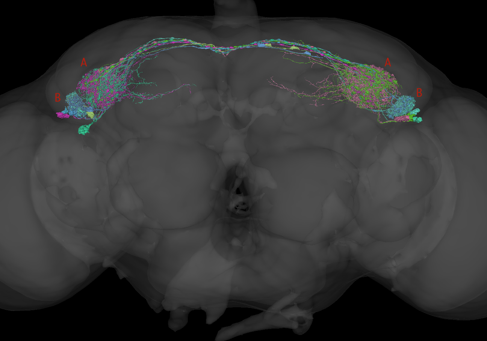
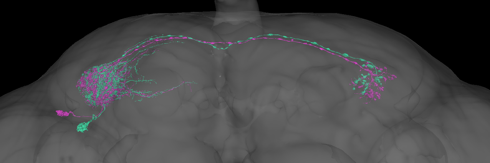
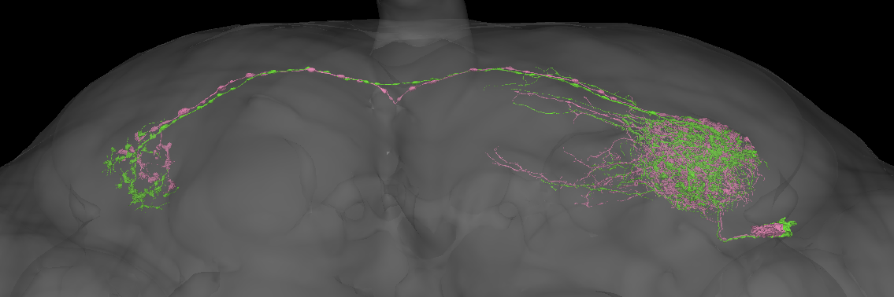
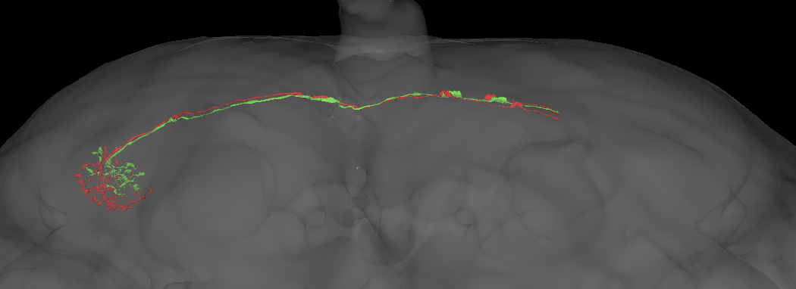

```{r, include = FALSE}
knitr::opts_chunk$set(
  collapse = TRUE,
  comment = "#>"
)
```

## Introduction

This short article gives an example of across dataset connectivity clustering using the [flywire](https://flywire.ai/) and [hemibrain](https://www.janelia.org/project-team/flyem/hemibrain) datasets. This provides support for specific neuronal cell types first proposed in the hemibrain.

TuTu neurons are a class of visual interneurons that connect the two optic tubercles on each side of the brain. Inputs to the tubercle include narrow field visual interneurons e.g. those responsive to small objects such as other flies. You can read more about them on VFB, where they are called [`adult tubercle-tubercle neuron` [FBbt_00051062]](https://v2.virtualflybrain.org/org.geppetto.frontend/geppetto?id=FBbt_00051062&i=VFB_00101567,VFB_jrchk7cz).

There are 4 TuTu neurons originating from each hemisphere (8 per brain). The TuTuA neurons have larger arborisations in the medial part of the optic tubercle; the TuTuB neurons have smaller arbours in the more lateral part. You can examine them in 3D using this [cocoglancer scene](https://neuroglancer-demo.appspot.com/#!%7B%22title%22:%22flywire-hemibrain%22%2C%22dimensions%22:%7B%22x%22:%5B4e-9%2C%22m%22%5D%2C%22y%22:%5B4e-9%2C%22m%22%5D%2C%22z%22:%5B4e-8%2C%22m%22%5D%7D%2C%22position%22:%5B136278.5%2C56063.5%2C436.5%5D%2C%22crossSectionScale%22:1.2071%2C%22projectionOrientation%22:%5B-0.023625720292329788%2C0.0059402878396213055%2C0.018635405227541924%2C0.9995295405387878%5D%2C%22projectionScale%22:90711.54637016413%2C%22projectionDepth%22:-88744875287147.48%2C%22layers%22:%5B%7B%22type%22:%22image%22%2C%22source%22:%22precomputed://gs://flywire_em/aligned/v1%22%2C%22tab%22:%22source%22%2C%22name%22:%22image_data%22%7D%2C%7B%22type%22:%22segmentation%22%2C%22source%22:%5B%7B%22url%22:%22precomputed://gs://flywire_v141_m630%22%2C%22subsources%22:%7B%22default%22:true%2C%22mesh%22:true%7D%2C%22enableDefaultSubsources%22:false%7D%2C%22precomputed://https://flyem.mrc-lmb.cam.ac.uk/flyconnectome/dynann/flytable-info-630%22%5D%2C%22tab%22:%22segments%22%2C%22segments%22:%5B%22720575940612218547%22%2C%22720575940614041238%22%2C%22720575940622538520%22%2C%22720575940623326868%22%2C%22720575940633550431%22%2C%22720575940635979000%22%2C%22720575940637997427%22%2C%22720575940621226846%22%5D%2C%22segmentQuery%22:%22TuTu%22%2C%22colorSeed%22:975507960%2C%22name%22:%22flywire%22%7D%2C%7B%22type%22:%22segmentation%22%2C%22source%22:%22precomputed://https://spine.itanna.io/files/data/hemibrain2flywire/precomputed/neuronmeshes/mesh#type=mesh%22%2C%22tab%22:%22segments%22%2C%22segments%22:%5B%22%21676836779%22%2C%22%215813013691%22%2C%22%21708290604%22%2C%22%21925008763%22%2C%22%21770226597%22%2C%225813014028%22%2C%22%21987759904%22%2C%22769544445%22%5D%2C%22segmentQuery%22:%22TuTu%22%2C%22colorSeed%22:2407669673%2C%22name%22:%22hemibrain_meshes%22%7D%2C%7B%22type%22:%22segmentation%22%2C%22source%22:%5B%22precomputed://https://spine.itanna.io/files/data/hemibrain2flywire_mirror/precomputed/neuronmeshes/mesh#type=mesh%22%2C%7B%22url%22:%22precomputed://https://spine.itanna.io/files/data/hemibrain2flywire/precomputed/neuronmeshes/mesh%22%2C%22subsources%22:%7B%22properties%22:true%7D%2C%22enableDefaultSubsources%22:false%7D%5D%2C%22tab%22:%22segments%22%2C%22segments%22:%5B%22676836779%22%2C%225813013691%22%2C%22708290604%22%2C%22925008763%22%2C%22770226597%22%2C%225813014028%22%2C%22987759904%22%2C%22769544445%22%5D%2C%22segmentQuery%22:%22TuTu%22%2C%22colorSeed%22:2407669673%2C%22name%22:%22hemibrain_meshes_mirr%22%2C%22visible%22:false%7D%2C%7B%22type%22:%22segmentation%22%2C%22source%22:%22precomputed://gs://flywire_neuropil_meshes/neuropils/neuropil_mesh_v141_v3%22%2C%22tab%22:%22segments%22%2C%22selectedAlpha%22:0.2%2C%22objectAlpha%22:0.2%2C%22segments%22:%5B%220%22%2C%221%22%2C%2210%22%2C%2211%22%2C%2212%22%2C%2213%22%2C%2214%22%2C%2215%22%2C%2216%22%2C%2217%22%2C%2218%22%2C%2219%22%2C%222%22%2C%2220%22%2C%2221%22%2C%2222%22%2C%2223%22%2C%2224%22%2C%2225%22%2C%2226%22%2C%2227%22%2C%2228%22%2C%2229%22%2C%223%22%2C%2230%22%2C%2231%22%2C%2232%22%2C%2233%22%2C%2234%22%2C%2235%22%2C%2236%22%2C%2237%22%2C%2238%22%2C%2239%22%2C%224%22%2C%2240%22%2C%2241%22%2C%2242%22%2C%2243%22%2C%2244%22%2C%2245%22%2C%2246%22%2C%2247%22%2C%2248%22%2C%2249%22%2C%225%22%2C%2250%22%2C%2251%22%2C%2252%22%2C%2253%22%2C%2254%22%2C%2255%22%2C%2256%22%2C%2257%22%2C%2258%22%2C%2259%22%2C%226%22%2C%2260%22%2C%2261%22%2C%2262%22%2C%2263%22%2C%2264%22%2C%2265%22%2C%2266%22%2C%2267%22%2C%2268%22%2C%2269%22%2C%227%22%2C%2270%22%2C%2271%22%2C%2272%22%2C%2273%22%2C%2274%22%2C%2275%22%2C%2276%22%2C%2277%22%2C%2278%22%2C%228%22%2C%229%22%5D%2C%22name%22:%22neuropil_mesh_v141_v3%22%2C%22visible%22:false%7D%2C%7B%22type%22:%22segmentation%22%2C%22source%22:%22precomputed://https://flyem.mrc-lmb.cam.ac.uk/flyconnectome/brain_mesh%22%2C%22tab%22:%22source%22%2C%22objectAlpha%22:0.28%2C%22segments%22:%5B%220%22%2C%221%22%5D%2C%22segmentColors%22:%7B%220%22:%22#6b6b6b%22%2C%221%22:%22#6b6b6b%22%7D%2C%22name%22:%22flywire_brain_mesh%22%7D%2C%7B%22type%22:%22segmentation%22%2C%22source%22:%22precomputed://https://spine.itanna.io/files/data/hemibrain2flywire/precomputed/neuropils/mesh#type=mesh%22%2C%22tab%22:%22source%22%2C%22objectAlpha%22:0.16%2C%22segments%22:%5B%22200%22%5D%2C%22colorSeed%22:422627114%2C%22segmentColors%22:%7B%22200%22:%22#e0e0e0%22%7D%2C%22name%22:%22hemibrain_neuropils%22%2C%22visible%22:false%7D%5D%2C%22showAxisLines%22:false%2C%22showScaleBar%22:false%2C%22selectedLayer%22:%7B%22visible%22:true%2C%22layer%22:%22flywire%22%7D%2C%22layout%22:%223d%22%7D) (cocoglancer is an across-dataset configuration of the [neuroglancer](https://github.com/google/neuroglancer) web app described [here](https://github.com/flyconnectome/flywire_annotations/tree/main/cocoglancer#readme)).

[](https://neuroglancer-demo.appspot.com/#!%7B%22title%22:%22flywire-hemibrain%22%2C%22dimensions%22:%7B%22x%22:%5B4e-9%2C%22m%22%5D%2C%22y%22:%5B4e-9%2C%22m%22%5D%2C%22z%22:%5B4e-8%2C%22m%22%5D%7D%2C%22position%22:%5B136278.5%2C56063.5%2C436.5%5D%2C%22crossSectionScale%22:1.2071%2C%22projectionOrientation%22:%5B-0.023625720292329788%2C0.0059402878396213055%2C0.018635405227541924%2C0.9995295405387878%5D%2C%22projectionScale%22:90711.54637016413%2C%22projectionDepth%22:-88744875287147.48%2C%22layers%22:%5B%7B%22type%22:%22image%22%2C%22source%22:%22precomputed://gs://flywire_em/aligned/v1%22%2C%22tab%22:%22source%22%2C%22name%22:%22image_data%22%7D%2C%7B%22type%22:%22segmentation%22%2C%22source%22:%5B%7B%22url%22:%22precomputed://gs://flywire_v141_m630%22%2C%22subsources%22:%7B%22default%22:true%2C%22mesh%22:true%7D%2C%22enableDefaultSubsources%22:false%7D%2C%22precomputed://https://flyem.mrc-lmb.cam.ac.uk/flyconnectome/dynann/flytable-info-630%22%5D%2C%22tab%22:%22segments%22%2C%22segments%22:%5B%22720575940612218547%22%2C%22720575940614041238%22%2C%22720575940622538520%22%2C%22720575940623326868%22%2C%22720575940633550431%22%2C%22720575940635979000%22%2C%22720575940637997427%22%2C%22720575940621226846%22%5D%2C%22segmentQuery%22:%22TuTu%22%2C%22colorSeed%22:975507960%2C%22name%22:%22flywire%22%7D%2C%7B%22type%22:%22segmentation%22%2C%22source%22:%22precomputed://https://spine.itanna.io/files/data/hemibrain2flywire/precomputed/neuronmeshes/mesh#type=mesh%22%2C%22tab%22:%22segments%22%2C%22segments%22:%5B%22%21676836779%22%2C%22%215813013691%22%2C%22%21708290604%22%2C%22%21925008763%22%2C%22%21770226597%22%2C%225813014028%22%2C%22%21987759904%22%2C%22769544445%22%5D%2C%22segmentQuery%22:%22TuTu%22%2C%22colorSeed%22:2407669673%2C%22name%22:%22hemibrain_meshes%22%7D%2C%7B%22type%22:%22segmentation%22%2C%22source%22:%5B%22precomputed://https://spine.itanna.io/files/data/hemibrain2flywire_mirror/precomputed/neuronmeshes/mesh#type=mesh%22%2C%7B%22url%22:%22precomputed://https://spine.itanna.io/files/data/hemibrain2flywire/precomputed/neuronmeshes/mesh%22%2C%22subsources%22:%7B%22properties%22:true%7D%2C%22enableDefaultSubsources%22:false%7D%5D%2C%22tab%22:%22segments%22%2C%22segments%22:%5B%22676836779%22%2C%225813013691%22%2C%22708290604%22%2C%22925008763%22%2C%22770226597%22%2C%225813014028%22%2C%22987759904%22%2C%22769544445%22%5D%2C%22segmentQuery%22:%22TuTu%22%2C%22colorSeed%22:2407669673%2C%22name%22:%22hemibrain_meshes_mirr%22%2C%22visible%22:false%7D%2C%7B%22type%22:%22segmentation%22%2C%22source%22:%22precomputed://gs://flywire_neuropil_meshes/neuropils/neuropil_mesh_v141_v3%22%2C%22tab%22:%22segments%22%2C%22selectedAlpha%22:0.2%2C%22objectAlpha%22:0.2%2C%22segments%22:%5B%220%22%2C%221%22%2C%2210%22%2C%2211%22%2C%2212%22%2C%2213%22%2C%2214%22%2C%2215%22%2C%2216%22%2C%2217%22%2C%2218%22%2C%2219%22%2C%222%22%2C%2220%22%2C%2221%22%2C%2222%22%2C%2223%22%2C%2224%22%2C%2225%22%2C%2226%22%2C%2227%22%2C%2228%22%2C%2229%22%2C%223%22%2C%2230%22%2C%2231%22%2C%2232%22%2C%2233%22%2C%2234%22%2C%2235%22%2C%2236%22%2C%2237%22%2C%2238%22%2C%2239%22%2C%224%22%2C%2240%22%2C%2241%22%2C%2242%22%2C%2243%22%2C%2244%22%2C%2245%22%2C%2246%22%2C%2247%22%2C%2248%22%2C%2249%22%2C%225%22%2C%2250%22%2C%2251%22%2C%2252%22%2C%2253%22%2C%2254%22%2C%2255%22%2C%2256%22%2C%2257%22%2C%2258%22%2C%2259%22%2C%226%22%2C%2260%22%2C%2261%22%2C%2262%22%2C%2263%22%2C%2264%22%2C%2265%22%2C%2266%22%2C%2267%22%2C%2268%22%2C%2269%22%2C%227%22%2C%2270%22%2C%2271%22%2C%2272%22%2C%2273%22%2C%2274%22%2C%2275%22%2C%2276%22%2C%2277%22%2C%2278%22%2C%228%22%2C%229%22%5D%2C%22name%22:%22neuropil_mesh_v141_v3%22%2C%22visible%22:false%7D%2C%7B%22type%22:%22segmentation%22%2C%22source%22:%22precomputed://https://flyem.mrc-lmb.cam.ac.uk/flyconnectome/brain_mesh%22%2C%22tab%22:%22source%22%2C%22objectAlpha%22:0.28%2C%22segments%22:%5B%220%22%2C%221%22%5D%2C%22segmentColors%22:%7B%220%22:%22#6b6b6b%22%2C%221%22:%22#6b6b6b%22%7D%2C%22name%22:%22flywire_brain_mesh%22%7D%2C%7B%22type%22:%22segmentation%22%2C%22source%22:%22precomputed://https://spine.itanna.io/files/data/hemibrain2flywire/precomputed/neuropils/mesh#type=mesh%22%2C%22tab%22:%22source%22%2C%22objectAlpha%22:0.16%2C%22segments%22:%5B%22200%22%5D%2C%22colorSeed%22:422627114%2C%22segmentColors%22:%7B%22200%22:%22#e0e0e0%22%7D%2C%22name%22:%22hemibrain_neuropils%22%2C%22visible%22:false%7D%5D%2C%22showAxisLines%22:false%2C%22showScaleBar%22:false%2C%22selectedLayer%22:%7B%22visible%22:true%2C%22layer%22:%22flywire%22%7D%2C%22layout%22:%223d%22%7D)

### Setup

If this is your first time using coconatfly, some additional setup is required beyond package installation. Please see the [getting started vignette](https://natverse.org/coconatfly/articles/getting-started.html) for details of downloading / authenticating to connectome data sources.

## Fetching the neurons

OK with that preamble, let's get started. First we need to load two required libraries.

```{r setup, message=FALSE}
library(dplyr)
library(coconatfly)
```

The following TuTu neurons are recorded in the hemibrain and FAFB-FlyWire. Note the use of a regular expression (introduced by `/`) to match against the type field. `.*` means any number of characters can follow TuTu in the type name.

```{r}
tutus=cf_meta(cf_ids('/type:TuTu.*', datasets = c("hemibrain", "flywire")))
tutus
```

```{r}
tutus %>% 
  count(dataset, type, side)
```

So we can see the hemibrain TuTuB neurons have been typed into two subtypes, but the flywire neurons have not. We can run across-dataset cosine connectivity 
clustering on these neurons like so:

```{r}
tutus %>% 
  cf_cosine_plot()
```

So this is interesting at a couple of levels. First we can see that the TuTuB hemibrain neurons separate into two groups. This is true even though things are a bit messy for the `TuTuB_a_hbL` neuron which will almost certainly be heavily truncated as it has its soma on the left hand (missing) side of the hemibrain.

We can also see the flywire neurons also split up nicely. So we have two groups of four neurons each. Each group contains one neuron from each hemisphere x dataset combination. So we can update our flywire cell typing to match the hemibrain TuTuB_a and TuTuB_b groups.

### TuTuA

However, interestingly we can also see that the TuTuA group splits very strongly in flywire into two groups that are not evident in the hemibrain. To me this strongly suggests that some property of the bilateral connectivity defines this difference.

We can try seeing if we just use the input connectivity to cluster if things resolve:

```{r}
tutus %>% 
  filter(grepl("TuTuA", type)) %>% 
  cf_cosine_plot(partners = 'in')
```

Hmm the situation is still the same. Since the two flywire groups are so well-separated this is almost certainly a real split. In fact there is a candidate anatomical difference in the placement of the contralateral axons that clearly correlates with this split.





This candidate axonal difference is even visible in the hemibrain.



However since the across-brain connectivity clustering does not yet support this (likely owing to a lack of shared labelled partner neurons), I will not record the split for now. I strongly suspect that we will observe this split in future connectomes though.

## Setting the new types

```{r}
tutus.hc <- tutus %>% 
  cf_cosine_plot(heatmap = F)
tutus.meta=cf_meta(tutus.hc$labels)

plot(tutus.hc, labels = tutus.meta$type)
```

```{r}
tutus.meta2=coconat::add_cluster_info(tutus.meta, tutus.hc, k = 5)
tutus.meta2 %>% 
  count(dataset, group_k5)
  
```

Group 4 contains the TuTuB_b neurons

```{r}
tutus.meta2 %>% 
  filter(group_k5==4)
```

Group 5 contains the TuTuB_b neurons

```{r}
tutus.meta2 %>% 
  filter(group_k5==5)
```

The following code could help find the Flybase/Virtual Fly Brain anatomy 
ontology (FBbt) ids for these neurons:

```{r, eval=FALSE}
natmanager::install(pkgs = 'vfbr')
vfbr::vfb_autocomplete_query('TuTuB') %>% 
  filter(grepl("FBbt", short_form))
```
